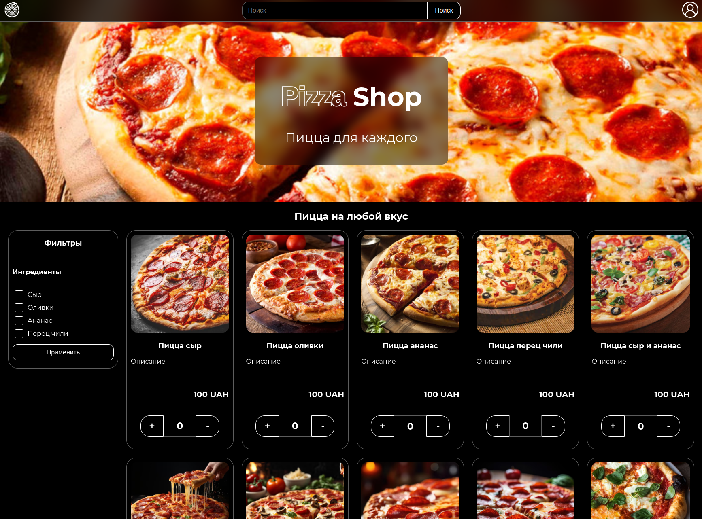
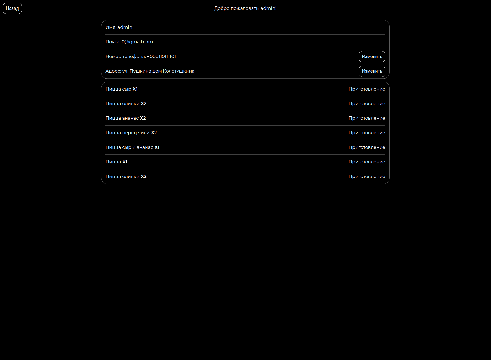

# Pizza Shop 

PizzaShop — это мой личный проект онлайн-магазина пиццы, созданный с использованием чистого Django. Это веб-приложение позволяет пользователям заказывать пиццу и управлять своими заказами с помощью простого и удобного интерфейса.

## Описание

PizzaShop включает в себя следующие функции:

- **Регистрация и аутентификация пользователей**.
- **Личный кабинет**: Пользователи имеют доступ к своему личному кабинету, где могут просматривать и редактировать свои данные, а также отслеживать текущие заказы.
- **Корзина покупок**: Поддержка добавления и удаления товаров в корзину, а также расчет общей стоимости заказа.
- **Фильтры продуктов**: Возможность фильтрации продуктов по различным критериям, таким как ингредиенты, размер и цена.
- **Список продуктов**: Отображение доступных продуктов с подробной информацией о каждом продукте.




## Технологии

- **Django**: Веб-фреймворк на Python для создания серверной логики и обработки запросов.
- **SQLite**: Встраиваемая реляционная база данных для хранения информации о пользователях, заказах и продуктах.
- **HTML/CSS/JavaScript**: Использованы для создания и стилизации пользовательского интерфейса без сторонних библиотек.

## Установка и запуск

1. Клонируйте репозиторий:

   ```bash
   git clone https://github.com/MrOmegaIsNotBad/PizzaShop.git
   ```

2. Перейдите в каталог проекта:

   ```bash
   cd PizzaShop
   ```

3. Создайте и активируйте виртуальное окружение:

   ```bash
   python -m venv env
   source env/bin/activate  # Для Windows используйте env\Scripts\activate
   ```

4. Установите зависимости:

   ```bash
   pip install -r requirements.txt
   ```

5. Запустите сервер разработки:

   ```bash
   python manage.py runserver
   ```

6. Откройте браузер и перейдите по адресу [http://localhost:8000](http://localhost:8000).

## Контрибьюция

Это личный проект, и основные изменения и улучшения осуществляю я сам. 

## Лицензия

Проект лицензирован под MIT License.

